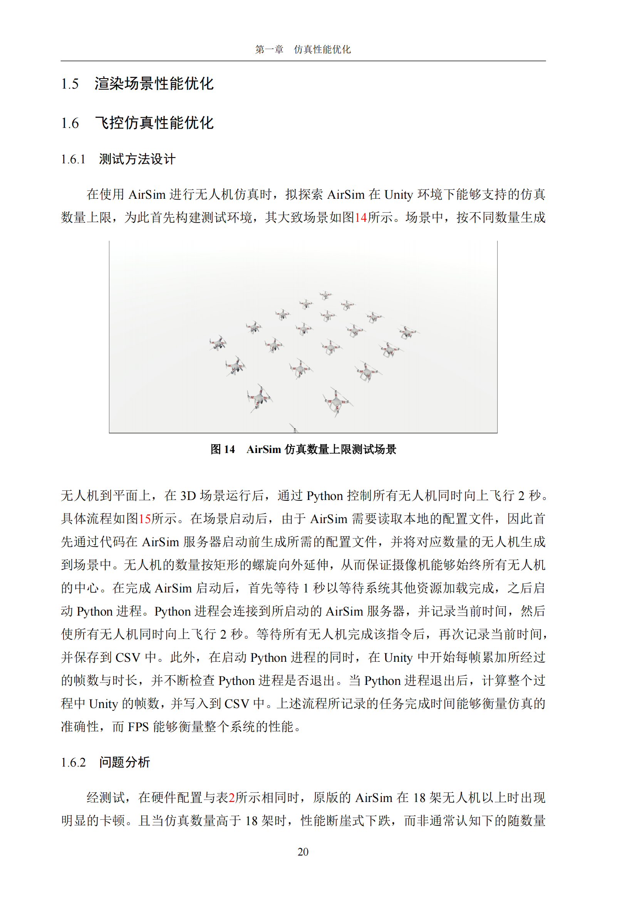
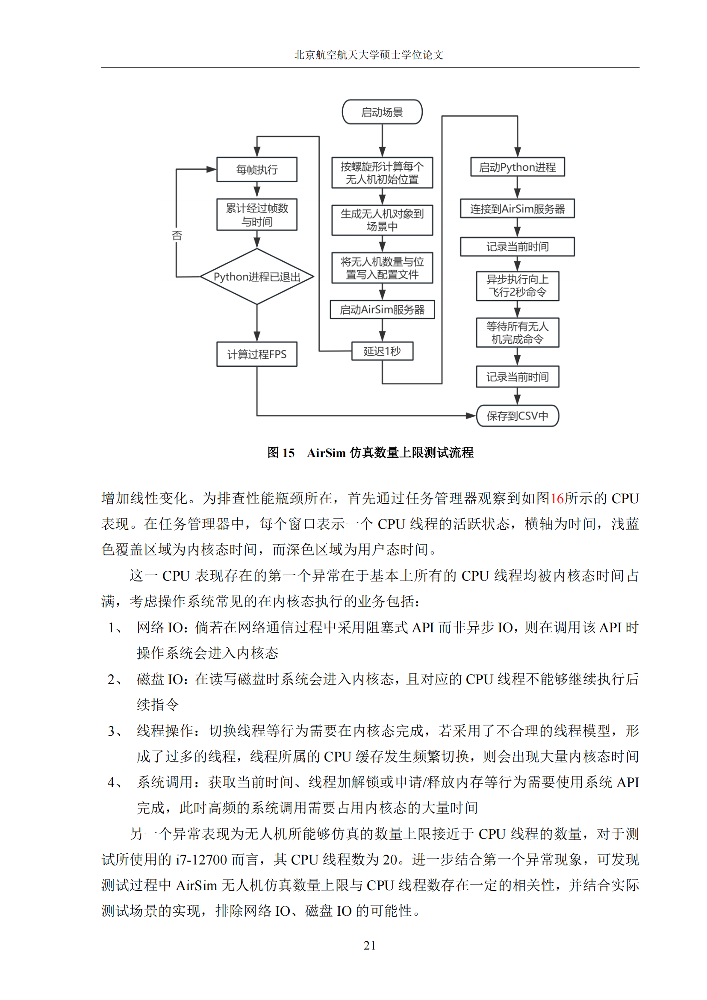
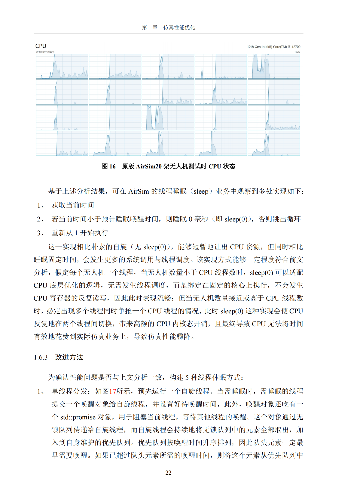
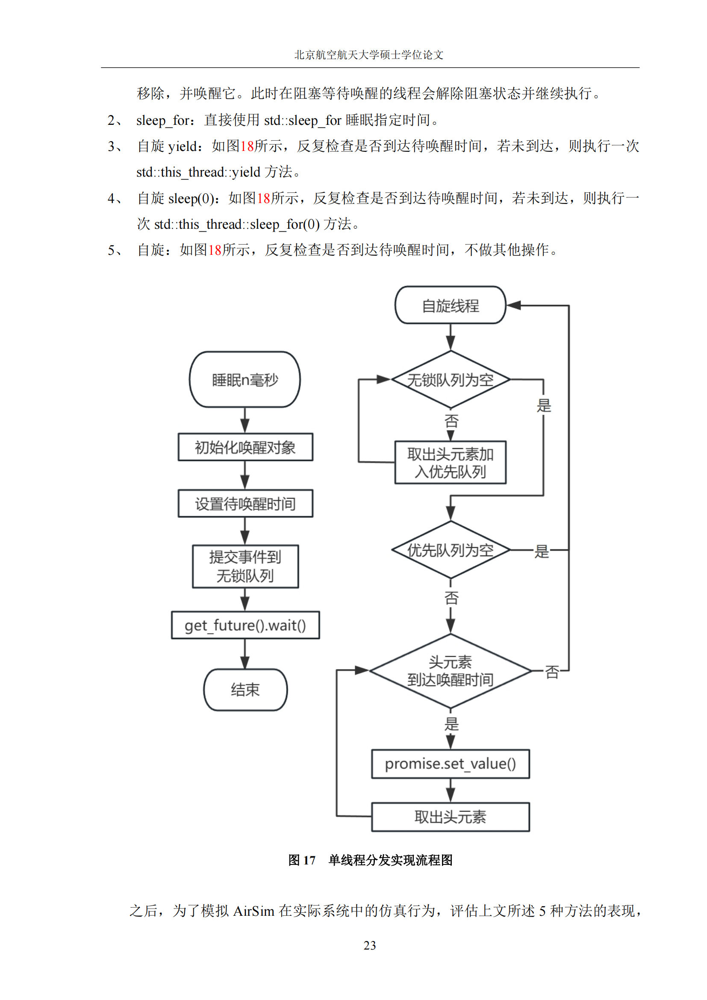
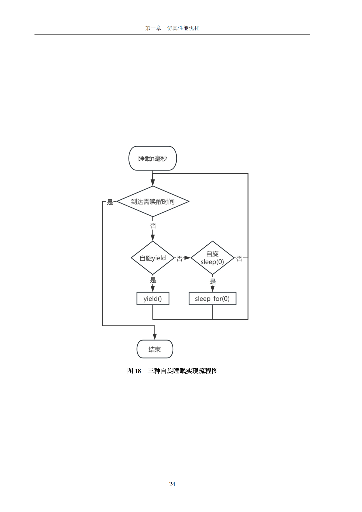
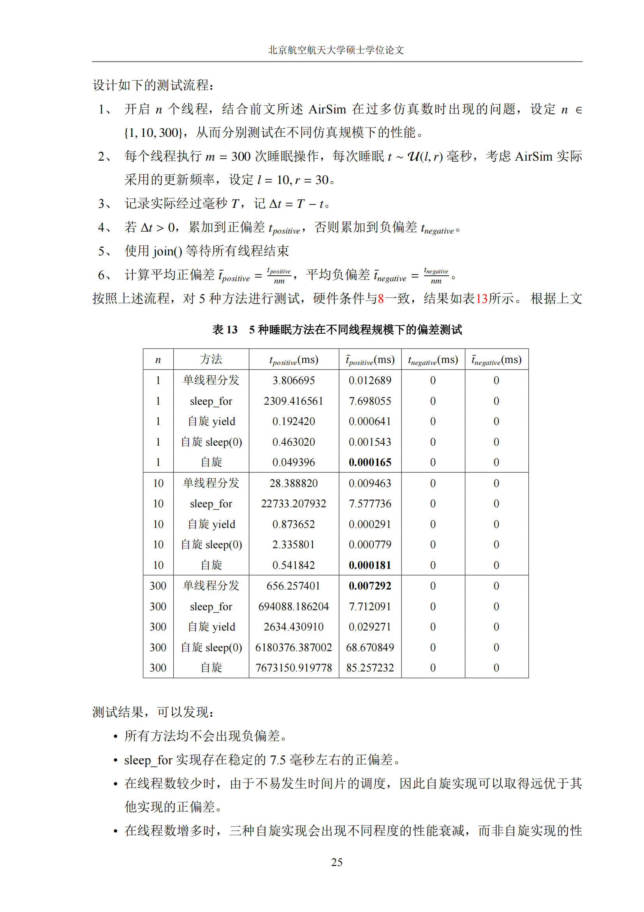
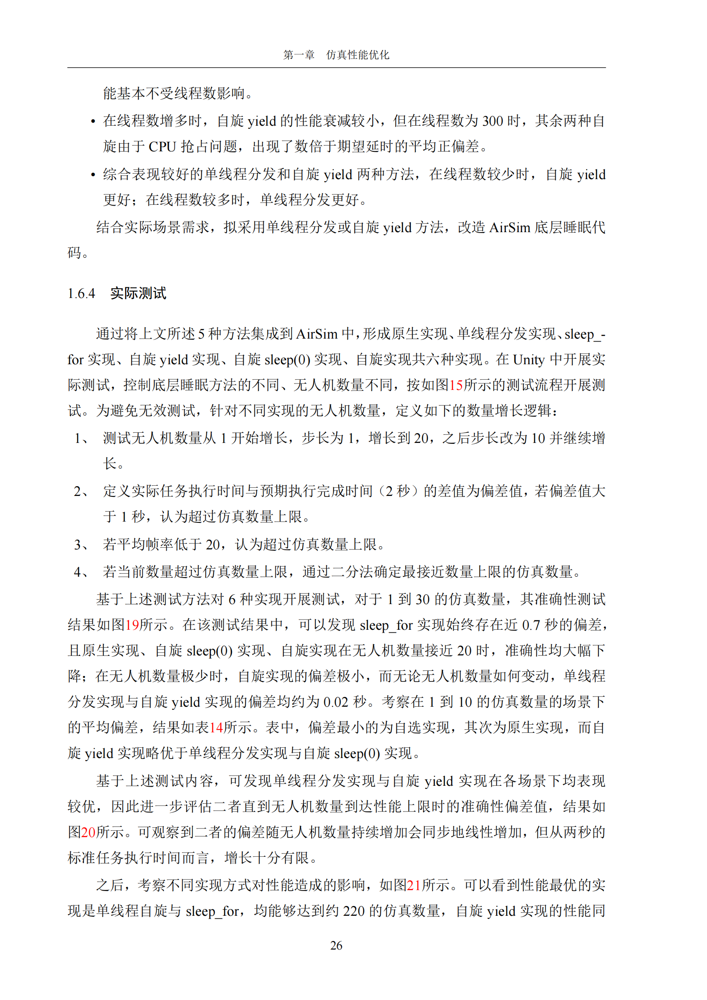
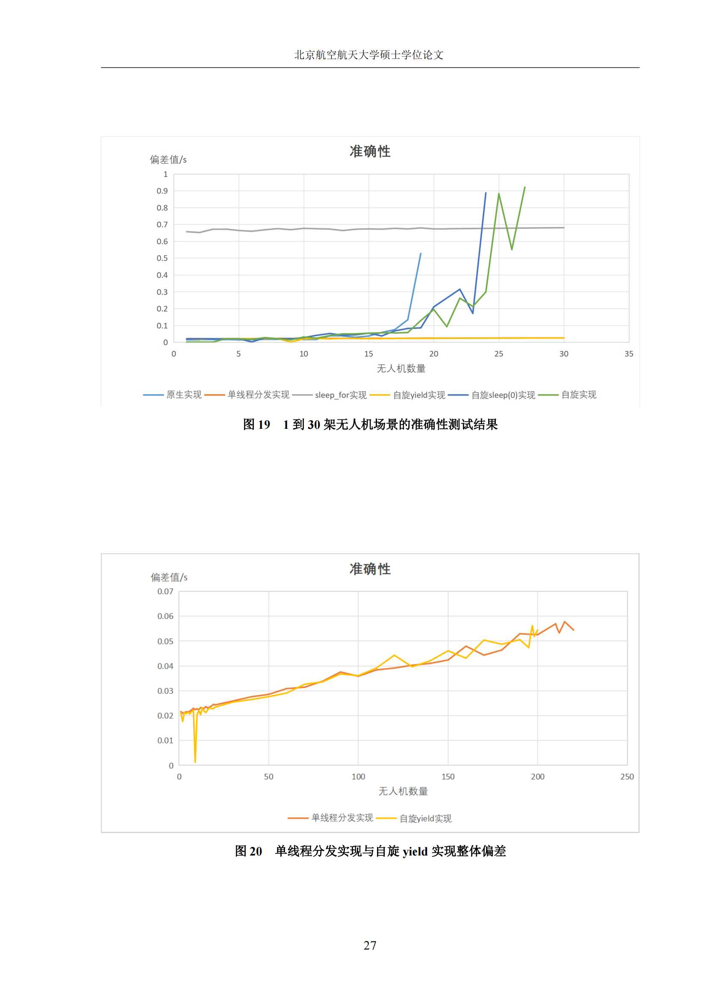
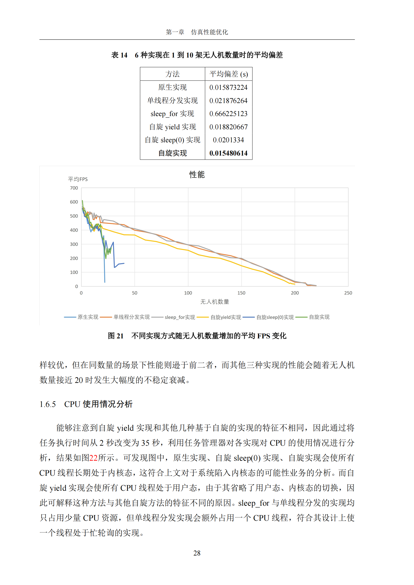
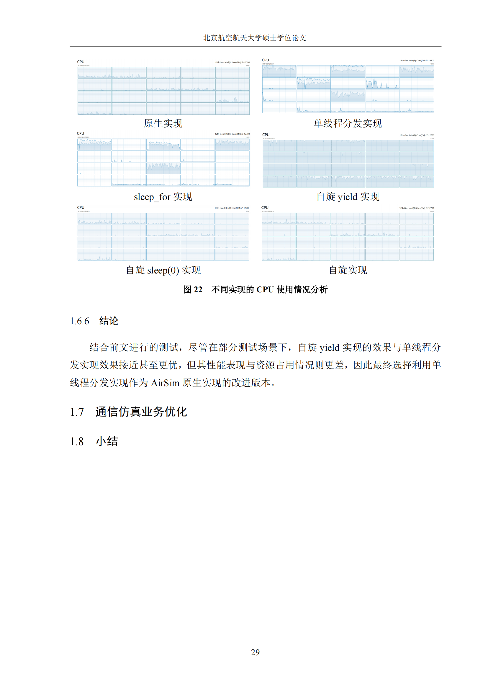

# [原始README在此处](./README-raw.md)
本库在原始AirSim仓库的基础上，增加了一个宏，用于实现不同的sleep策略，以或多或少的计时精确性为代价，改进AirSim在多机（>20 in i7-12700）仿真下的性能表现。

**应当注意，开启这些更改可能会影响AirSim原有的兼容性，仅能够确保在Windows平台的部分配置下能够成功构建。**

# 构建

首先需要将boost_1_86_0文件夹放到[AirLib\deps\]()下，最终使其形成：
- AirLib
  - deps
    - boost_1_86_0
      - boost
      - libs
      - more
      - status
      - tools
      - ...
    - eigen3
    - MavLinkCom
    - rpclib

形式的结构。其中boost_1_86_0可以在[此处](https://archives.boost.io/release/1.86.0/source/boost_1_86_0.zip)下载。

修改[AirLib\include\common\common_utils\AdvanceSleep.h]()第二行对SLEEP_MODE的取值即可，其中：

- `0`：AirSim原生实现不做修改
- `1`：单线程自旋+`future.get`唤醒
- `2`：`std::this_thread::sleep_for`
- `3`：自旋+线程内`std::this_thread::yield`
- `4`：自旋+线程内`std::this_thread::sleep_for(0)`
- `5`：自旋+线程内空转

# 文档

